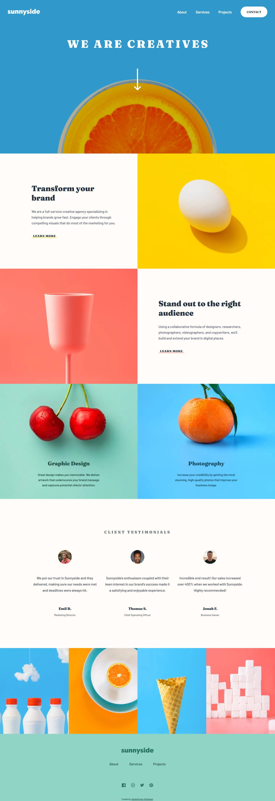

# sunnyside

My solution to the [Sunnyside agency landing page](https://www.frontendmentor.io/challenges/agency-landing-page-7yVs3B6ef) challenge on Frontend Mentor.

- Live: https://sunnyside-agency-landing-page.abdelrhman-ahmed8881.workers.dev
- Code: https://github.com/MrBlackvanta/sunnyside-agency-landing-page

## Built with

- Next.js
- React
- TypeScript
- Tailwind CSS

## Author

- [LinkedIn](https://www.linkedin.com/in/abdelrhman-vanta/)
- [UpWork](https://www.upwork.com/freelancers/mrblackvanta)
- [Frontend Mentor](https://www.frontendmentor.io/profile/MrBlackvanta)
